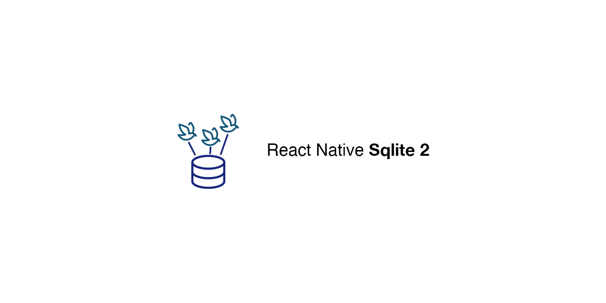

# 

SQLite3 Native Plugin for React Native for Android, iOS, Windows and macOS.
This plugin provides a [WebSQL](http://www.w3.org/TR/webdatabase/)-compatible API to store data in a react native app, by using a SQLite database on the native side.

Inspired by fantastic work done by [Nolan Lawson](https://github.com/nolanlawson/cordova-plugin-sqlite-2).
It should be a drop-in replacement for [react-native-sqlite-storage](https://github.com/andpor/react-native-sqlite-storage).
It works pretty well with [PouchDB](https://github.com/stockulus/pouchdb-react-native) on React Native app.

#### Used by

 [mozilla / notes](https://github.com/mozilla/notes)
 [Inkdrop](https://www.inkdrop.app/)

## Why?

The reason for this plugin is that `react-native-sqlite-storage` has some problems when used with PouchDB:

- It [can't store string data with `\u0000`](https://github.com/andpor/react-native-sqlite-storage/issues/107) due to [the react native problem](https://github.com/facebook/react-native/issues/12731).
  - PouchDB heavily uses the Null character in the document IDs for building index, so it won't work well.
- It's unstable for storing PouchDB's attachments: [#6037](https://github.com/pouchdb/pouchdb/issues/6037).

This plugin solves these problems.

### Newer SQLite3 on Android

Even the latest version of Android is several versions behind the latest version of SQLite, whereas iOS has newer version.
React Native SQLite 2 uses [sqlite-android](https://github.com/requery/sqlite-android) which allows you to use the latest version of it with new SQLite features enabled:

- [JSON1 extension](https://www.sqlite.org/json1.html)
- [Common Table expressions](https://www.sqlite.org/lang_with.html)
- [Indexes on expressions](https://www.sqlite.org/expridx.html)
- [FTS5 extension](https://sqlite.org/fts5.html)

## Getting started

Add react-native-sqlite-2 to your dependencies:

```shell
$ npm install react-native-sqlite-2 --save
```

### Link native dependencies

From react-native 0.60 autolinking will take care of the link step but don't forget to run `pod install`.

```shell
$ react-native link react-native-sqlite-2
```

#### iOS/macOS

If using cocoapods in the `ios/` directory run

```shell
$ pod install
```

#### Android

Please make sure AndroidX is enabled in your project by editing `android/gradle.properties` and adding 2 lines:

```
android.useAndroidX=true
android.enableJetifier=true
```

## Usage

```javascript
import SQLite from 'react-native-sqlite-2'

const db = SQLite.openDatabase('test.db', '1.0', '', 1)
db.transaction(function(txn) {
  txn.executeSql('DROP TABLE IF EXISTS Users', [])
  txn.executeSql(
    'CREATE TABLE IF NOT EXISTS Users(user_id INTEGER PRIMARY KEY NOT NULL, name VARCHAR(30))',
    []
  )
  txn.executeSql('INSERT INTO Users (name) VALUES (:name)', ['nora'])
  txn.executeSql('INSERT INTO Users (name) VALUES (:name)', ['takuya'])
  txn.executeSql('SELECT * FROM `users`', [], function(tx, res) {
    for (let i = 0; i < res.rows.length; ++i) {
      console.log('item:', res.rows.item(i))
    }
  })
})
```

See [an example project](/example/) for more detail.

### Using with PouchDB

It can be used with [pouchdb-adapter-react-native-sqlite](https://github.com/craftzdog/pouchdb-adapter-react-native-sqlite).

```javascript
import PouchDB from 'pouchdb-react-native'
import SQLite from 'react-native-sqlite-2'
import SQLiteAdapterFactory from 'pouchdb-adapter-react-native-sqlite'

const SQLiteAdapter = SQLiteAdapterFactory(SQLite)
PouchDB.plugin(SQLiteAdapter)
var db = new PouchDB('mydb', { adapter: 'react-native-sqlite' })
```

### Foreign key support

As part of database initialization, this library will enable foreign key support automatically on both iOS & Android. Thus, any tables that define foreign key constraints will have them enforced whether or not foreign key support is explicitly enabled/disabled by PRAGMA statements sent via SQL.

## Changelog

See [CHANGELOG.md](./CHANGELOG.md)

## Contributing

See [CONTRIBUTING.md](./CONTRIBUTING.md)

## Original Cordova SQLite Bindings from Nolan Lawson

https://github.com/nolanlawson/cordova-plugin-sqlite-2

The issues and limitations for the actual SQLite can be found on this site.
